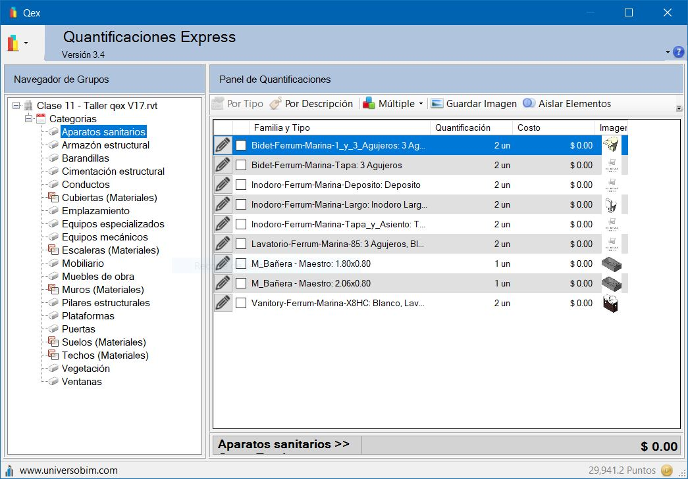

# Qex

Qex es un plugin de Revit que obtiene toda la información de un Modelo BIM y crea un Cómputo de manera automática

## Requisitos
* Autodesk Revit 2016
* Autodesk Revit 2017
* Autodesk Revit 2018
* Autodesk Revit 2019
* Autodesk Revit 2020
* Autodesk Revit 2021

## Instalador
Puedes descargar el instalador de la última versión en este link
* https://github.com/gorovt/Qex/releases
